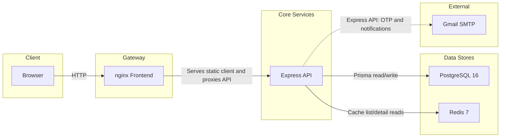

# BK English Center

BK English Center is a full-stack management system for an English language center. It combines a static HTML/CSS/JavaScript frontend with an Express API, Prisma, PostgreSQL, Redis caching, JWT role-based access, Gmail SMTP notifications, Swagger API docs, and Docker Compose deployment.

## Contents

- [Architecture](#architecture)
- [Features](#features)
- [Tech Stack](#tech-stack)
- [Quick Start with Docker](#quick-start-with-docker)
- [Local Development](#local-development)
- [Environment Variables](#environment-variables)
- [API Overview](#api-overview)
- [Database](#database)
- [Project Structure](#project-structure)
- [Scripts](#scripts)
- [Notes](#notes)

## Architecture



Runtime flow:

- The `frontend` container builds SCSS, patches `client/config.js` for same-origin API calls, and serves static files with nginx.
- nginx serves HTML/CSS/JS and reverse-proxies `/api/*` plus backend route prefixes to `backend:3000`.
- The `backend` container runs the Express API on port `3000`.
- PostgreSQL stores application data. Flyway applies SQL migrations from `server/sql`.
- Redis stores list/detail cache entries for selected services and is also available for future OTP/session work.
- Gmail SMTP is used for OTP and notification email delivery.

## Features

- Public pages for home, courses, course detail, contact, login, signup, and user course/profile views.
- Role-specific areas for admin, staff, teacher, and student workflows.
- Course and class management.
- Student enrollment, attendance, marks, payment, and prize tracking.
- Teacher assignment, attendance, rating, payment, prize, and file tracking.
- Staff attendance, salary, prize, and statistics screens.
- Sponsor, email whitelist, activity log, and registration log management.
- JWT authentication with role gates for admin, staff, teacher, and student access.
- OTP-assisted registration for privileged roles.
- API i18n through `Accept-Language` with `en`, `vi`, `fr`, `de`, `es`, `ca`, and `it` locale files.
- Redis-backed cache for course, class, student, teacher, sponsor, and join-class reads.
- Swagger UI and raw OpenAPI JSON.

## Tech Stack

| Layer | Technology |
| --- | --- |
| Frontend | HTML, Vanilla JavaScript, SCSS, Bootstrap/Flowbite-style pages, nginx |
| Backend | Node.js 22, Express 5, Prisma 7, `@prisma/adapter-pg` |
| Database | PostgreSQL 16 |
| Cache | Redis 7 with `ioredis` |
| Auth | JWT, bcrypt, role-based middleware |
| Email | Nodemailer with Gmail SMTP |
| API docs | Swagger UI, swagger-jsdoc |
| Migration | Flyway SQL migrations, Prisma schema/client |
| Tooling | Docker Compose, Jest, Supertest, ESLint, Prettier, Sass |

## Quick Start with Docker

Prerequisites:

- Docker Desktop or Docker Engine with the `docker compose` plugin.
- A Gmail App Password if you want OTP and notification email to work.

Steps:

```bash
cp server/.env.example .env
# Edit .env: POSTGRES_PASSWORD, JWT_SECRET, MAIL_USER, MAIL_PASS, and optional GOOGLE_CLIENT_ID.

docker compose up --build -d
docker compose exec backend npm run db:seed
```

Demo login accounts after seeding:

| Role | Username | Password |
| --- | --- | --- |
| Admin | `admin01` | `Admin@1234` |
| Staff | `staff01` | `Staff@1234` |
| Teacher | `teacher01` | `Teacher@1234` |
| Student | `student001` | `Student@1234` |

Open:

- App: `http://localhost`
- API docs: `http://localhost/api-docs`
- Raw OpenAPI JSON: `http://localhost/api-docs.json`

Stop the stack:

```bash
docker compose down
```

Remove containers and volumes:

```bash
docker compose down -v
```

## Local Development

### Backend

Use PostgreSQL and Redis from Docker, then run the API locally:

```bash
cp server/.env.example .env
docker compose up postgres redis migrate -d

cd server
cp .env.example .env
npm install
npm run db:generate
npm run db:seed
npm run dev
```

The backend listens on `http://localhost:3000` by default.

### Frontend

```bash
cd client
npm install
npm run watch:css
```

Serve the `client` folder with a static server such as VS Code Live Server or:

```bash
npx serve . -p 5500
```

In local development, `client/config.js` points API calls at `http://localhost:3000`. On Docker or Vercel deployments it uses same-origin `/api` requests. For Vercel, set the project environment variable `BACKEND_URL` to the public backend URL so `client/api/[...path].js` can proxy requests.

## Environment Variables

For Docker, copy `server/.env.example` to `.env` at the repository root. The compose file reads root `.env`, while the backend container also receives explicit `DATABASE_URL` and `REDIS_URL` values built from the PostgreSQL and Redis services.

| Variable | Required | Default | Purpose |
| --- | --- | --- | --- |
| `PORT` | No | `3000` | Express listen port |
| `NODE_ENV` | No | `development` | Runtime mode |
| `DATABASE_URL` | Yes for local backend | none | Prisma/PostgreSQL connection string |
| `REDIS_URL` | Yes for local backend | `redis://localhost:6379` | Redis connection string |
| `JWT_SECRET` | Yes | development fallback exists | JWT signing secret |
| `JWT_EXPIRES_IN` | No | `28800` | Token lifetime in seconds |
| `MAIL_USER` | Yes in production | none | Gmail SMTP account |
| `MAIL_PASS` | Yes in production | none | Gmail App Password |
| `CORS_ORIGIN` | No | `http://localhost:5500` | Allowed browser origin |
| `GOOGLE_CLIENT_ID` | No | none | Google Identity Services client ID |
| `CACHE_TTL` | No | `300` | Redis cache TTL in seconds |
| `POSTGRES_USER` | No | `bkec` | Compose PostgreSQL user |
| `POSTGRES_PASSWORD` | Yes | `changeme` | Compose PostgreSQL password |
| `POSTGRES_DB` | No | `bkec` | Compose PostgreSQL database |

## API Overview

Swagger is generated from `server/src/config/swagger.js`, route files, and controller JSDoc blocks.

Authentication:

```http
Authorization: Bearer <jwt_token>
Accept-Language: en
```

Important routes:

| Prefix | Access | Notes |
| --- | --- | --- |
| `GET /users/user` | Public | Login with `username` and `userpassword` query parameters |
| `POST /users/user` | Public or OTP-gated | Create account; admin/staff require OTP |
| `PATCH /users/user` | Authenticated | Update current account profile |
| `GET /users/info` | Authenticated | Current user profile |
| `/sendMail` | Public | Send OTP email |
| `/sendPay`, `/sendPrize`, `/sendSalary`, `/sendWarning`, `/sendFile`, `/sendCheer` | Authenticated | Notification email helpers |
| `/courses/all` | Public | Public course catalogue |
| `/courses` and `/courses/course` | Authenticated | Course list/detail and CRUD |
| `/admins` | Admin | Admin dashboard/statistics |
| `/staffs` | Staff/Admin | Staff profile, attendance, salary, prize, stats |
| `/classes` | Staff/Admin | Class management |
| `/teachers`, `/teacherjoinclasses` | Teacher/Staff/Admin | Teacher records and class assignments |
| `/students`, `/studentjoinclasses` | Student/Staff/Admin | Student records, enrollments, marks, payments |
| `/files`, `/emails`, `/sponsors`, `/logs`, `/register-logs` | Protected | Operational admin resources |

Role gates live in `server/src/middleware/useApiKey.js`. Public routes are mounted in `server/routes/index.js`; most other route groups are wrapped with `requireApiKey`.

## Database

The Prisma schema is in `server/prisma/schema.prisma`. The initial SQL migration is in `server/sql/V1__init.sql` and is applied by the `migrate` service in Docker Compose.

Core models:

| Model | Purpose |
| --- | --- |
| `User` | Login account with username, password hash, email, and role |
| `Student`, `Teacher`, `Staff`, `Admin` | Role-specific profiles linked to `User` |
| `Course` | Course catalogue and pricing/attendance defaults |
| `Class` | Scheduled class instance of a course |
| `StudentJoinClass` | Student enrollment, attendance, marks, payment, and prize state |
| `TeacherJoinClass` | Teacher assignment, attendance, rating, payment, and prize state |
| `ManageStaff` | Staff monthly attendance, salary, and prize state |
| `TeacherHasFile` | Teaching material tracking |
| `Email` | Registration email whitelist by role |
| `Sponsor` | Sponsor records |
| `Log` | Activity audit log |
| `RegisterLog` | Account registration log |

Mutable profile and business entities use a `version` field that the service layer increments on updates.

## Project Structure

```text
BK-English-Center/
|-- docker-compose.yml
|-- .env.example
|-- README.md
|-- client/
|   |-- Dockerfile
|   |-- nginx.conf
|   |-- config.js
|   |-- styles/
|   |   |-- main.scss
|   |   |-- main.css
|   |   |-- _variables.scss
|   |   |-- _base.scss
|   |   |-- _components.scss
|   |   |-- _mobile.scss
|   |   `-- pages/
|   |-- js/
|   |   |-- config.js
|   |   |-- skeleton.js
|   |   |-- theme.js
|   |   `-- pages/
|   |-- pages/
|   |   |-- admin/
|   |   |-- auth/
|   |   |-- public/
|   |   |-- staff/
|   |   |-- student/
|   |   `-- teacher/
|   |-- i18n/
|   |-- utils/
|   `-- img/
`-- server/
    |-- Dockerfile
    |-- index.js
    |-- package.json
    |-- prisma.config.ts
    |-- prisma/
    |   |-- schema.prisma
    |   `-- seed.js
    |-- sql/
    |   `-- V1__init.sql
    |-- routes/
    |-- src/
    |   |-- config/
    |   |-- controllers/
    |   |-- middleware/
    |   |-- models/
    |   |-- services/
    |   `-- locales/
    `-- test/
        |-- api/
        |-- integration/
        `-- unit/
```

## Scripts

Backend (`server/package.json`):

| Command | Purpose |
| --- | --- |
| `npm start` | Run production API |
| `npm run dev` | Run API with nodemon |
| `npm run db:generate` | Generate Prisma client |
| `npm run db:migrate` | Run Prisma migrate deploy |
| `npm run db:seed` | Seed demo data |
| `npm run db:studio` | Open Prisma Studio |
| `npm test` | Run Jest tests serially |
| `npm run test:cov` | Run Jest coverage |
| `npm run eslint` | Lint server source |
| `npm run format:check` | Check Prettier formatting |

Frontend (`client/package.json`):

| Command | Purpose |
| --- | --- |
| `npm run build:css` | Compile compressed SCSS to `styles/main.css` |
| `npm run build:css:dev` | Compile expanded CSS for debugging |
| `npm run watch:css` | Watch SCSS and rebuild on changes |
| `npm run lint` | Lint frontend JavaScript |
| `npm run format:check` | Check Prettier formatting |
| `npm run build:icons` | Extract developer icons |

Docker Compose:

| Command | Purpose |
| --- | --- |
| `docker compose up --build -d` | Build and start the full stack |
| `docker compose logs -f` | Stream service logs |
| `docker compose exec backend npm run db:seed` | Seed demo data in the backend container |
| `docker compose down` | Stop containers |
| `docker compose down -v` | Stop containers and remove volumes |

## Notes

- The root `.env.example` appears older than the current PostgreSQL/Prisma Compose setup. Prefer `server/.env.example` as the source for new root `.env` files.
- `server/src/models` still contains legacy model-style data functions, while newer service files use Prisma and Redis directly.
- OTP state is currently an in-memory counter in `server/src/middleware/useApiKey.js`; Redis or PostgreSQL would be safer for production.
- `server/README.md` and `client/README.md` may contain older MySQL or route descriptions. This root README reflects the current code paths checked in this repository.
